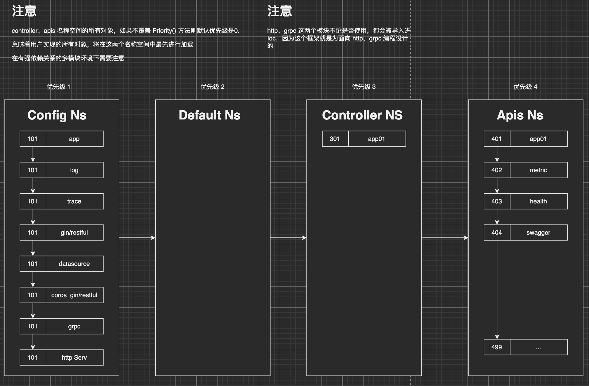

# infra
> 1. DDD 模型 Ioc 微服务开发框架
> 2. 内置 Gin、Restful 框架，以及添加了 health、Cors、Swagger、Metric、Trace... 等开箱即用的工具支持
> 3. 提供默认配置，用户可以自定义配置来进行覆盖，框架会自动加载用户自定义配置
> 4. 提供自动感知web 框架功能，即注册了Gin 的视图就使用Gin 框架、注册了Restful 框架就使用 Restful 框架

### 框架原理

#### Ioc 优先级说明
- Ioc 框架设置了默认4个名称空间
  - Config namespace：存放基础的框架配置对象、以及其他对象的依赖对象，比如gin、restful、gorm、application
  - Default namespace：存放用户自定义对象，拥有较高的优先级，在Controller Namespace 之前被初始化
  - Controller Namespace：控制器对象，负责具体业务逻辑处理
  - Apis Namespace：接口对象，负责对外提供API 接口

- Ioc 优先级示意图：



#### Ioc 默认配置解析
1. Application：用于定义当前微服务描述信息
```yaml
application:
  appName: "svc01"
  description: "my service"
  domain: "example.com"
```
2. Cors：跨域配置
```yaml
cors:
  allowedHeaders: [ "*" ]
  allowedDomains: [ ".*" ]    # for gorestful
  allowOrigins: [ "*" ]        # for gin
  allowedMethods: [ "*" ]
  exposeHeaders: [ "*" ]
  allowCookies: true
  maxAge: 43200
```
3. Datasrouce: 数据库配置
```yaml
datasource:
  otlp: false
  host: "127.0.0.1"
  port: 3306
  database: "must_set"
  username: "root"
  password: "redhat"
  debug: true
```

4. Http：http 服务配置
```yaml
http:
  host: "127.0.0.1"
  port: "8080"
  readHeaderTimeout: 30
  readTimeout: 60
  writeTimeout: 60
  idleTimeout: 300
  maxHeaderSize: "16kb"
  trace: false
  ginMode: "debug"
```
5. Log：日志配置
```yaml
log:
  trace: true
  callerDeep: 3
  level: debug
  filename: "logs/app.log"
  maxSize: 10
  maxAge: 30
  maxBackups: 6
  LocalTime: true
  compress: false
  deep: 3
```

6. Otlp：遥测配置
```yaml
otlp:
  httpEndpoint: "127.0.0.1:4318"
  grpcEndpoint: "127.0.0.1:4317"
  enableTLS: false
```

### 单元测试

#### 在Ioc 中进行单元测试
1. 示例
```go
import (
    _ "case04/apps"  // 导入 apps/registry.go 中注册的所有模块
    "case04/apps/user"
    "context"
    "github.com/qiaogy91/ioc"
    "testing"
)

var (
    ctx = context.Background()
    c   = user.GetSvc()  // 通过Ioc 获取controller 
)

func init() {
    // 初始化Ioc 框架
    if err := ioc.ConfigIocObject("/Users/qiaogy/GolandProjects/projects/skill/case04/etc/application.yaml"); err != nil {
        panic(err)
    }
}
// 测试用例
func TestFn1(t *testing.T) {}
```


### 内建应用
#### Health 检测接入
```go
package main

import (
  _ "github.com/qiaogy91/ioc/apps/health/restful" // restful 框架的健康探测服务
  _ "github.com/qiaogy91/ioc/apps/health/gin" // gin 框架的健康探测服务，二选一
)
```
```shell
go run main.go start -t file
# 2024-10-04T14:06:19+08:00 INFO   gin/api.go:28             > Get the Health using http://127.0.0.1:8080/health component:HEALTH
```

#### Gin Swagger 文档
```go
package api

// @Summary 修改文章标签
// @Description  修改文章标签
// @Tags         文章管理
// @Produce  json
// @Param id path int true "ID"
// @Param name query string true "ID"
// @Param state query int false "State"
// @Param modified_by query string true "ModifiedBy"
// @Success 200 {string} json "{"code":200,"data":{},"msg":"ok"}"
// @Router /restful/v1/tags/{id} [put]
func (h *Handler) ginCreatTable(ctx *gin.Context) {
  if err := h.svc.CreatTable(ctx); err != nil {
  ctx.JSON(http.StatusBadRequest, err)
  return
  }
  ctx.JSON(200, "ok")
}
```
```shell
cd ProjectRoot/
swag init
```
```go
package main

import (
  _ "github.com/qiaogy91/example/docs"         // gin doc，上一步中生成的文档在项目根路径下 docs
  _ "github.com/qiaogy91/ioc/apps/health/gin"  // gin health
  _ "github.com/qiaogy91/ioc/apps/swagger/gin" // gin swagger
  _ "github.com/qiaogy91/ioc/config/cors/gin"  // gin cors
)
```
```shell
go run main.go -t file
# 2024-10-04T14:06:38+08:00 INFO   gin/api.go:32             > Get the API doc using http://127.0.0.1:8080/swagger/doc.json component:SWAGGER
```

#### Restful Swagger 文档
```go
package api

func (h *Handler) Init() {
  h.svc = app01.GetSvc()
  h.log = log.Sub(app01.AppName)

  // Restful 框架路由注册
  ws := gorestful.ModuleWebservice(h)
  ws.Route(ws.GET("").To(h.restfulList).Doc("用户列表"))
  ws.Route(ws.POST("").To(h.restfulCreate).Doc("创建用户"))
  ws.Route(ws.POST("/table").To(h.restfulCreateTable).Doc("创建表结构"))
  // 打印所有已注册的路由
  for _, ws := range restful.RegisteredWebServices() {
      for _, r := range ws.Routes() {
          h.log.Info().Msgf("%-6s %s", r.Method, r.Path)
      }
  }
}
```
```go
package main

import (
  _ "github.com/qiaogy91/infra/ioc/apps/swagger/restful"
  _ "github.com/qiaogy91/infra/ioc/config/cors/restful"
  _ "github.com/qiaogy91/infra/ioc/apps/health/restful"
)
```
```shell
go run main.go -t file 
# 2024-10-04T14:06:19+08:00 INFO   gin/api.go:32             > Get the API doc using http://127.0.0.1:8080/swagger/doc.json component:SWAGGER
```

#### Metric 指标接入
1. 导入Ioc 模块
```go
package main

import (
_ "github.com/qiaogy91/ioc/apps/metrics/gin" // gin metric
_ "github.com/qiaogy91/ioc/apps/metrics/restful" // restful metric，二选一
)
```
```shell
go run main.go start -t file 
# 2024-10-04T19:51:07+08:00 INFO   gin/api.go:47             > Get the Metric using http://127.0.0.1:8080/metrics component:METRICS
```
```text
# HELP http_request_duration_histogram Histogram of the duration of HTTP requests
# TYPE http_request_duration_histogram histogram
http_request_duration_histogram_bucket{method="GET",path="/app01/",le="1"} 0
http_request_duration_histogram_bucket{method="GET",path="/app01/",le="2"} 1
http_request_duration_histogram_bucket{method="GET",path="/app01/",le="3"} 1
http_request_duration_histogram_bucket{method="GET",path="/app01/",le="4"} 3
http_request_duration_histogram_bucket{method="GET",path="/app01/",le="5"} 4
http_request_duration_histogram_bucket{method="GET",path="/app01/",le="6"} 4
http_request_duration_histogram_bucket{method="GET",path="/app01/",le="7"} 4
http_request_duration_histogram_bucket{method="GET",path="/app01/",le="+Inf"} 4
```

#### Trace 指标接入
```go
import _ "github.com/qiaogy91/ioc/config/otlp" // 开启遥测功能
```
```shell
go run main.go start -t file
```
```text
2024-10-04T23:51:12+08:00 INFO   server/server.go:56       > loaded configs: [app log trace gin-framework datasource cors grpc http] component:APPLICATION-SERVER
2024-10-04T23:51:12+08:00 INFO   gin/framework.go:44       > gin trace enabled component:GIN-FRAMEWORK
2024-10-04T23:51:12+08:00 INFO   datasource/mysql.go:69    > mysql trace enabled component:DATASOURCE
```